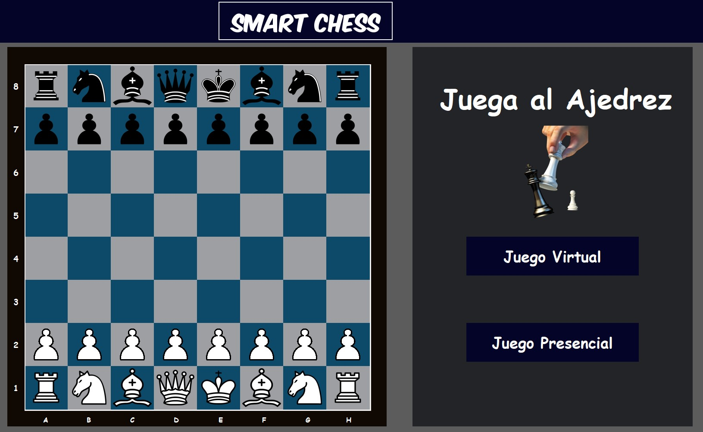

# Hola, mi nombre es Emilio Lemos 👋 
### Ingeniero en Mecatrónica | Desarrollo de Software | Desarrollo de Hardware

Soy Ingeniero en Mecatrónico, profesional desde 2023.

Trabaje como pasante durante 3 meses en Ituran Ecuador una empresa multinacional, donde me ocupe de un proyecto para la mejora del rendimiento en línea de producción, emplee conocimientos en SolidWorks para el diseño de piezas mecánicas en 3D y colaboraba en el mantinimiento de la línea de producción. 

Actualmente, busco desarrollarme como profesional trabajando en proyectos personales como SmartChess una aplicación de escritorio desarrollada en Python con el framework de Tkinter y C++ para comunicación con una esp32.

Mi objetivo es dedicarme al desarrollo de software y hardware embebido, me gusta armar prototipos y convertirlos con el tiempo en un producto real y funcional. 

## Proyectos

### Smart Chess

## Encuéntrame en:

